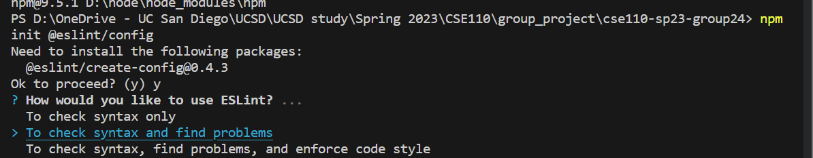

# Phase 1 CI/CD Pipeline

## Introduction
The goal of this phase is to create a vetting phase of the CI/CD pipeline that ensures code quality and automates the testing and documentation generation process. This is achieved through the use of linting, code quality tools, human review, unit testing, and documentation generation tools.

## Pipeline Overview

The pipeline is built on Github Actions and consists of the following steps:

1. Linting: This step checks for code style consistency and formatting issues using ESLint. If there are any issues, the pipeline fails and provides feedback to the developer.   We chose to use this as Haoyang has experience with it and he recommended it. ESLint is an open source project that helps you find and fix problems with JavaScript code. In addition, it statically analyzes code to quickly find problems, and it is built into text editors and runs ESLint as part of our project’s continuous integration pipeline to find issues. After it finds the issues, it will fix problems automatically most of the time and be syntax-aware, which means we won’t face errors introduced by transitional find-and-repace algorithms. In addition, if we want,  we can customize it. For example, pre-processs code, use custom parsers, and add rules besides ESLint’s built-in rules.The guidelines to use ESList can be found [here](https://eslint.org/docs/latest/).  

Installation Instructions: 
- (A) Install Node.js ready and built with SSL support.
- (B) Install ESLint using command `npm init @eslint/config`. Then choose third option “To check syntax, find problems, and enforce code style”.

- (C) Configure ESLint using command `npm init @eslint/config -- --config semistandard`

- (D) Run ESLint on any file, such as yourfile.js using command `npx eslint yourfile.js`

Some useful resources to use ESLint:
- [Why I always use ESLint in my projects](https://youtu.be/ZuDIXV94Z1w)
- [Use ESLint in Your Project](https://eslint.org/docs/latest/use/)
- [ESLint Quickstart - find errors automatically](https://www.youtube.com/watch?v=qhuFviJn-es&ab_channel=freeCodeCamp.org)

Pros of Using ESLint:
a. Rules Are Customizable.
b. Provides Code consistency
c. Helps in Catching errors

Cons of Using ESLint:
a. Not always correct
b. Gives False Positives
c. Doesn’t Fix Unused Variable
