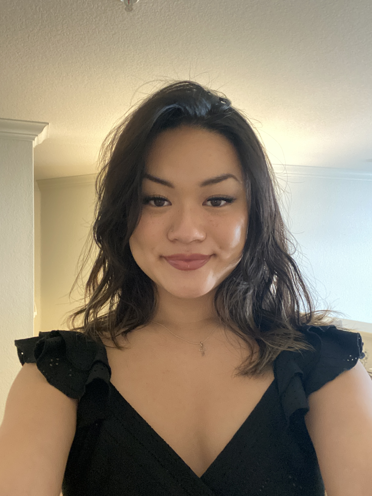
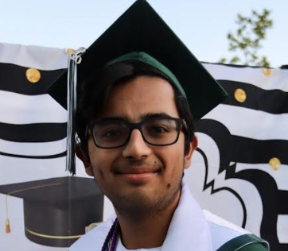
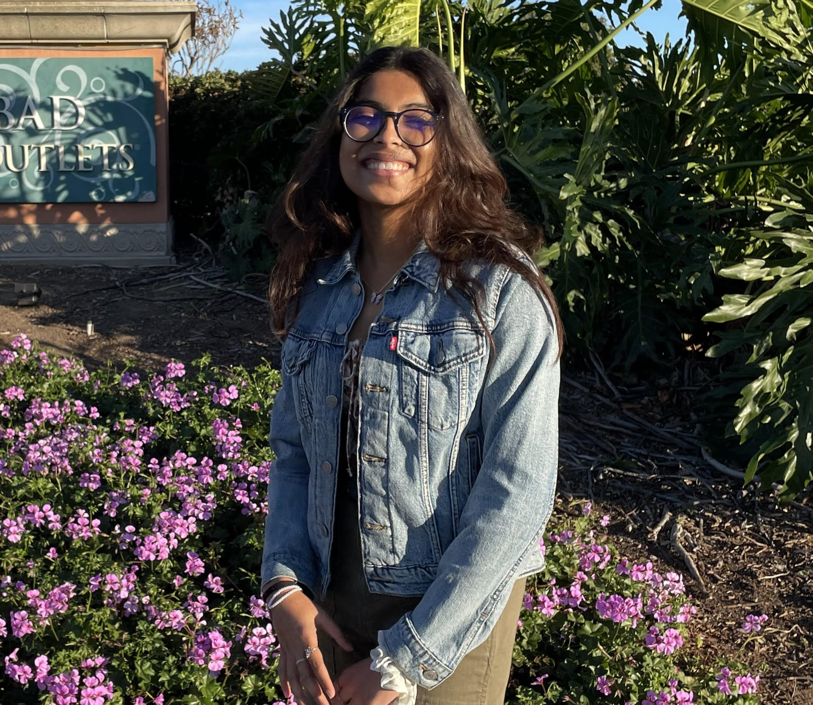
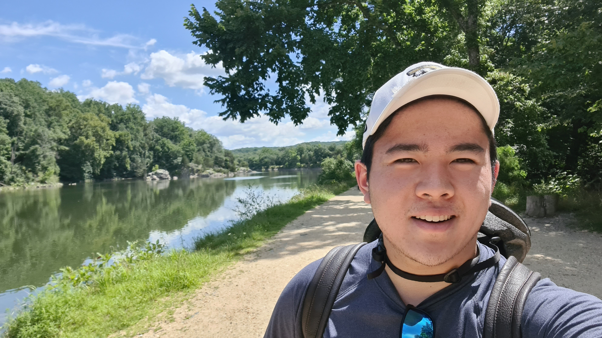
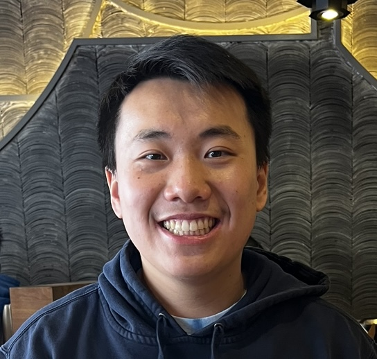
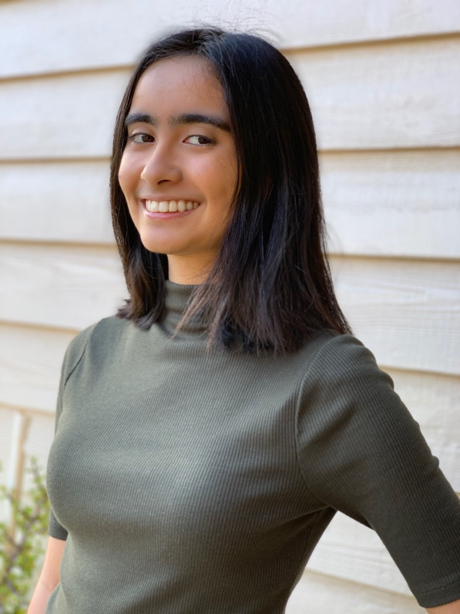
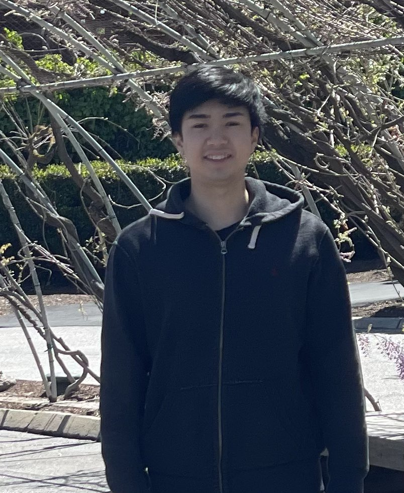
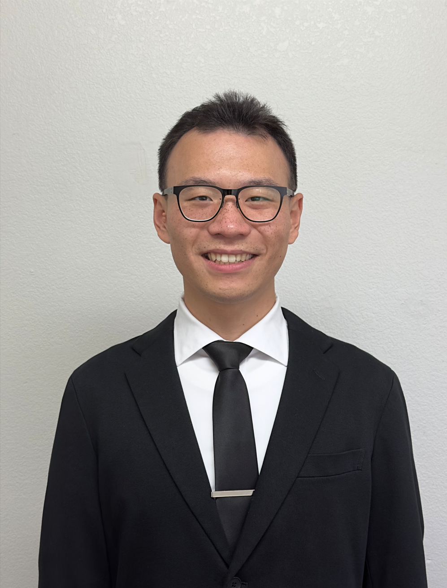

# We Take Showers
### CSE110 Spring23 Team24

Values: Empathy, Communication, Integrity, Growth

## Members

## Linda Wu

- CS
- Junior
- [Page](https://liindawu.github.io/Lab1/)
  
Hi! My name is Linda and some of my professional interests include product management and software engineering.

## Kartik Gugnani

- Computer Science
- Junior
- [Page](https://github.com/kgugnani)
  
Hello! I'm Kartik and I'm a junior studying Computer Science. I'm interested in software engineering and web development.

## Sumit Shetye

- Math-CS
- Junior
- [Page](https://sumitshetye2.github.io/first-lab/)
  
Hello! My name is Sumit and my interests lie in software engineering and game development.

## Maanasa Prasad

- Math-CS
- Sophomore
- [Page](https://maanasa64.github.io/cse110-lab01/)
  
Hello! My name is Maanasa Prasad and I am interested in Software Engineering. 

## Nicholas Ho

- Computer Science
- Sophomore
- [Page](https://nickho2048.github.io/Cse-110-revised/index)
  
Hello! My name is Nicholas Ho, and I'm interested in Artificial Intelligence, Front End Development, and Product Management. 

## Nathan Huey

- Math-CS
- Sophomore
- [Page](https://nahuey.github.io/cse110sp2023-lab1/)
  
Hello! My name is Nathan Huey and I am interested in software engineering and data science.

## Sholehani Hafezi

- Computer Science
- Junior
- [Page](https://sholehani.github.io/cse110-lab1/)
  
Hi! My name is Shol and I interested mainly in web development and software engineering. 

## Benjamin Liang

- Major Math - CS
- Year Sophomore
- [Page](https://beliang.github.io/cse110-lab1/)
  
Hello! My name is Benjamin Liang and I am interested in Artificial Intelligence and Backend Development.

## Haoyang Guo

- Math-CS
- Junior
- [Page](https://haoyangguo.github.io/cse110-lab1/)
  
Hi everybody! I look forward to working with the team and learning essential soft skills that can prepare me for the industry.

## Bingyang Yu

- Major Math-CS
- Senior
- [Page](https://8yby8sd.github.io/CSE110Lab1/)

Hello! My name is Bingyang Yu and I am interested in Computer Visualization and Computer Graph.
